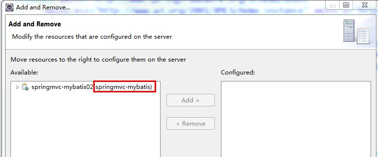
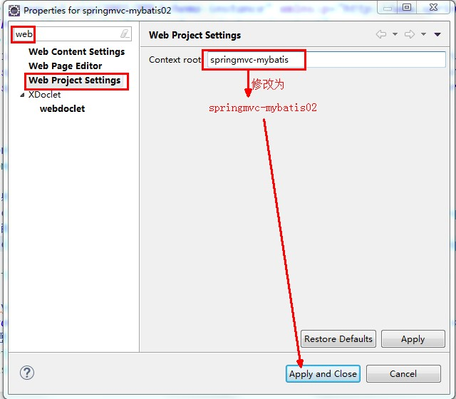

# Maven
## maven 创建javaSE项目
- 先下载Maven工具的解压版，地址http://maven.apache.org/download.cgi 选择 apache-maven-3.6.1-bin.zip
- 解压，并将解压目录配置进MAVEN_HOME环境变量,再在path系统变量里加入%MAVEN_HOME%\bin
- 测试.命令行输入mvn -version
- 利用mvn命令创建java程序.cmd输入如下命令(注意自定义目录位置)mvn archetype:generate -DgroupId={project-packaging} -DartifactId={project-name} -DarchetypeArtifactId=maven-archetype-quickstart -DinteractiveMode=false

- 为了导入Eclipse还需要先 **cd project-name/** 再输入`mvn eclipse:eclipse`
---
## 下载定制库到本地maven库(定制库指的是不在本地库中，也不在中心库中的jar)
- 使用mvn命令安装(例如kaptcha库) 注意f:\kaptcha-2.3.jar这个文件必须先在f盘新建好
- `mvn install:install-file -Dfile=f:\kaptcha-2.3.jar -DgroupId=com.google.code -DartifactId=kaptcha -Dversion=2.3 -Dpackaging=jar`
- 执行完上述命令,kaptcha库已经加入本地资源库,假如需要加入项目,则添加进pom.xml就行,如:
    ```
    <dependency>
        <groupId>com.google.code</groupId>
        <artifactId>kaptcha</artifactId>
        <version>2.3</version>
    </dependency>
    ```
---
## maven创建javaWeb项目(注意自定义目录位置)
- `mvn archetype:generate -DgroupId=com.foxconn -DartifactId=CounterWebApp -DarchetypeArtifactId=maven-archetype-webapp -DinteractiveMode=false`
- 为了导入Eclipse还需要先 **cd CounterWebApp** 再输入`mvn eclipse:eclipse -Dwtpversion=2.0`
- 更新pom.xml文件,如下:
    ```
    <project xmlns="http://maven.apache.org/POM/4.0.0"
        xmlns:xsi="http://www.w3.org/2001/XMLSchema-instance"
        xsi:schemaLocation="http://maven.apache.org/POM/4.0.0 http://maven.apache.org/maven-v4_0_0.xsd">
        <modelVersion>4.0.0</modelVersion>
        <groupId>com.foxconn</groupId>
        <artifactId>CounterWebApp</artifactId>
        <packaging>war</packaging>
        <version>1.0-SNAPSHOT</version>
        <name>CounterWebApp Maven Webapp</name>
        <url>http://maven.apache.org</url>
        <properties>
            <jdk.version>1.8</jdk.version>
            <spring.version>4.1.1.RELEASE</spring.version>
            <jstl.version>1.2</jstl.version>
            <junit.version>4.11</junit.version>
            <logback.version>1.0.13</logback.version>
            <jcl-over-slf4j.version>1.7.5</jcl-over-slf4j.version>
        </properties>
        <dependencies>

            <!-- Junit Test -->
            <dependency>
                <groupId>junit</groupId>
                <artifactId>junit</artifactId>
                <version>${junit.version}</version>
            </dependency>

            <!-- Spring Core -->
            <dependency>
                <groupId>org.springframework</groupId>
                <artifactId>spring-core</artifactId>
                <version>${spring.version}</version>
                <exclusions>
                    <exclusion>
                        <groupId>commons-logging</groupId>
                        <artifactId>commons-logging</artifactId>
                    </exclusion>
                </exclusions>
            </dependency>

            <dependency>
                <groupId>org.slf4j</groupId>
                <artifactId>jcl-over-slf4j</artifactId>
                <version>${jcl-over-slf4j.version}</version>
            </dependency>
            <dependency>
                <groupId>ch.qos.logback</groupId>
                <artifactId>logback-classic</artifactId>
                <version>${logback.version}</version>
            </dependency>

            <dependency>
                <groupId>org.springframework</groupId>
                <artifactId>spring-web</artifactId>
                <version>${spring.version}</version>
            </dependency>

            <dependency>
                <groupId>org.springframework</groupId>
                <artifactId>spring-webmvc</artifactId>
                <version>${spring.version}</version>
            </dependency>

            <!-- jstl  -->
            <dependency>
                <groupId>jstl</groupId>
                <artifactId>jstl</artifactId>
                <version>${jstl.version}</version>
            </dependency>

        </dependencies>
        <build>
            <finalName>CounterWebApp</finalName>
            <plugins>
                <!-- eclipse plugin -->
                <plugin>
                    <groupId>org.apache.maven.plugins</groupId>
                    <artifactId>maven-eclipse-plugin</artifactId>
                    <version>2.9</version>
                    <configuration>
                        <!-- Always download and attach dependencies source code -->
                        <downloadSources>true</downloadSources>
                        <downloadJavadocs>false</downloadJavadocs>

                        <!-- Avoid type mvn eclipse:eclipse -Dwtpversion=2.0  -->
                        <wtpversion>2.0</wtpversion>
                    </configuration>
                </plugin>

                <!-- compiler plugin -->
                <plugin>
                    <groupId>org.apache.maven.plugins</groupId>
                    <artifactId>maven-compiler-plugin</artifactId>
                    <version>2.3.2</version>
                    <configuration>
                        <source>${jdk.version}</source>
                        <target>${jdk.version}</target>
                    </configuration>
                </plugin>

                <!-- Tomcat Plugin -->
                <plugin>
                    <groupId>org.apache.tomcat.maven</groupId>
                    <artifactId>tomcat8-maven-plugin</artifactId>
                    <version>2.2</version>
                    <configuration>
                        <path>/CounterWebApp</path>
                    </configuration>
                </plugin>
            </plugins>
        </build>
    </project>
    ```
- 再执行`mvn eclipse:eclipse`来使改动生效(不需要-Dwtpversion=2.0，是因为在pom.xml里的maven-eclipse-plugin配置了`<wtpversion>2.0</wtpversion>`)
---
## Maven插件(依赖)查询网址
[http://mvnrepository.com/](http://mvnrepository.com/)

---
## 按照教程，mvn创建javaweb项目，执行`mvn eclipse:eclipse -Dwtpversion=2.0`导入到eclipse没有src/main/java目录问题
**自己新建就好了**
- 右键Java Resourses -> new -> source folder
- 选项目,选src/main文件夹
- 在 ‘folder name’输入位置会自动出现‘src/main’，你只需要在后面加上/java即可
---
## Eclipse的初始化工作
- 设置UTF-8编码
    - `windows -> preference -> General -> workspace`
- 设置jsp文件的编码
    - `windows -> preference -> Web -> JSP File`
- 设置代码自动提示
    - 
---
## Maven在eclipse中的配置(虽然2019.6版eclipse已经集成maven，但还是要配置)
- 修改用户设置文件的位置：`windows -> preference -> Maven -> User setting`。默认C:\${USER}\.m2\setting.xml，实际是没有的，所以我们把它指向maven解压目录下的conf/setting.xml
- 选用我们自己下载解压的maven软件：`windows -> preference -> Maven -> Installations`。再添加、选目录等等...
---
# Mybaits
## Eclipse写mapper.xml时没有标签提示
- 分别访问`http://mybatis.org/dtd/mybatis-3-mapper.dtd`和`http://mybatis.org/dtd/mybatis-3-config.dtd`.访问即下载,下载完成后将这两个dtd文件妥善放置
- 打开eclipse `windows -> preference -> XML -> XML Catalog`，点击`add -> File System`选中dtd文件，再在`key`栏输入`-//mybatis.org//DTD Mapper 3.0//EN`(或 `-//mybatis.org//DTD Config 3.0//EN`)对应文件名即可。完成！
- 
- 
---
## Eclipse在xml文件中注释与取消注释的快捷键
- 注释(需要先选中注释文本):`Alt + Shift + /`
- 取消注释(需要先选中注释文本):`Alt + Shift + \`
---
## Eclipse中复制的web项目的部署名和访问路径修改
- 
- 部署名仍然是旧名
- 
- 下面开始修改(两个地方)
    - 
    - 
---
## 纯Mybatis练习(没有Spring框架)时的文件目录及说明
- src
    - com.foxconn.junit(测试模块)
        - Mappertest.java
    - com.foxconn.mapper(mapper映射文件和对应接口)
        - UserMapper.java(一个接口,必须与下面的xml名一致)
        - UserMapper.xml
    - com.foxconn.pojo(实体类)
        - User.java
    - jdbc.properties
    - log4j.properties
    - sqlMapConfig.xml
---
## 接上，具体代码以及注解贴上
- Mappertest.java
    ```
    package com.foxconn.junit;

    import static org.junit.Assert.*;

    import java.io.InputStream;

    import org.apache.ibatis.io.Resources;
    import org.apache.ibatis.session.SqlSession;
    import org.apache.ibatis.session.SqlSessionFactory;
    import org.apache.ibatis.session.SqlSessionFactoryBuilder;
    import org.junit.Test;

    import com.foxconn.mapper.UserMapper;
    import com.foxconn.pojo.User;

    public class MybatisMapperTest {

        
        @Test
        public void testMapper() throws Exception {
            //加载核心配置文件
            String resource = "sqlMapConfig.xml";
            InputStream in = Resources.getResourceAsStream(resource);
            //创建SqlSessionFactory
            SqlSessionFactory sqlSessionFactory = new SqlSessionFactoryBuilder().build(in);
            //创建SqlSession
            SqlSession sqlSession = sqlSessionFactory.openSession();
            
            //SqlSEssion帮我生成一个实现类(给接口反射就行)
            UserMapper userMapper = sqlSession.getMapper(UserMapper.class);
            
            User user = userMapper.findUserById(10);
            System.out.println(user);
        }
    }

    ```
- UserMapper.java
    ```
    package com.foxconn.mapper;

    import com.foxconn.pojo.User;

    public interface UserMapper {
        //遵循四个原则
        //方法名  == User.xml 中的id
        //返回值类型  与  Mapper.xml文件中返回值类型要一致
        //方法的入参类型 与Mapper.xml中入参的类型要一致
        //用命名空间绑定此接口(即xml中的namespace要填写此接口，如namespace="com.foxconn.mapper.UserMapper")
        public User findUserById(Integer i);

        public Integer insertUser(User vo);
	
    }

    ```
- UserMapper.xml
    ```
    <?xml version="1.0" encoding="UTF-8" ?>
    <!DOCTYPE mapper
    PUBLIC "-//mybatis.org//DTD Mapper 3.0//EN"
    "http://mybatis.org/dtd/mybatis-3-mapper.dtd">

    <!-- namespace就是映射接口UserMapper.java的位置 -->
    <mapper namespace="com.itheima.mybatis.mapper.UserMapper">


        <!-- 通过ID查询一个用户 
        如果参数类型parameterType等于一个pojo，下面的#{x}要换成对应的pojo的成员变量，如#{id}，
        并且对应映射接口文件的方法也要改
        -->
        <select id="findUserById" parameterType="Integer" resultType="com.itheima.mybatis.pojo.User">
            select * from user where id = #{x}
        </select>

        
        <!-- 根据用户名称模糊查询用户列表
        #{}    select * from user where id = ？    占位符  ? ==  '五'
        ${}    select * from user where username like '%五%'  字符串拼接  
        第二种方法会有可能被SQL注入且必须是${value},因为它是字符串拼接,所以建议用下面这种方式"%"#{x}"%"
        -->
        <select id="findUserByUsername" parameterType="String" resultType="com.itheima.mybatis.pojo.User">
            select * from user where username like "%"#{x}"%"
        </select>
        
        
        <!-- 添加用户 
        如果需要获取新增用户的主键id,标签增加useGeneratedKeys="true" keyColumn="id"，
        即<insert id="insertUser" useGeneratedKeys="true" keyColumn="id" parameterType="com.itheima.mybatis.pojo.User">
        获取id则直接用user.getId(),因为该语句映射的接口方法，返回的是一个update的条数，例如1
        -->
        <insert id="insertUser" parameterType="com.itheima.mybatis.pojo.User">
            insert into user (username,birthday,address,sex) 
            values (#{username},#{birthday},#{address},#{sex})
        </insert>
        
    </mapper>
    ```
- jdbc.properties
    ```
    jdbc.driver=com.mysql.jdbc.Driver
    jdbc.url=jdbc:mysql://localhost:3306/mybatis?characterEncoding=utf-8
    jdbc.username=root
    jdbc.password=wang2702
    ```
- sqlMapConfig.xml
    ```
    <?xml version="1.0" encoding="UTF-8" ?>
    <!DOCTYPE configuration
    PUBLIC "-//mybatis.org//DTD Config 3.0//EN"
    "http://mybatis.org/dtd/mybatis-3-config.dtd">

    <configuration>
        <properties resource="jdbc.properties"/>

        <!-- 别名,目前没发现有啥用-->
        <typeAliases>
            <package name="com.itheima.mybatis.pojo"/>
        </typeAliases>

        <!-- 和spring整合后 environments配置将废除    -->
        <environments default="development">
            <environment id="development">
                <!-- 使用jdbc事务管理 -->
                <transactionManager type="JDBC" />
                <!-- 数据库连接池 -->
                <dataSource type="POOLED">
                    <property name="driver" value="${jdbc.driver}" />
                    <property name="url" value="${jdbc.url}" />
                    <property name="username" value="${jdbc.username}" />
                    <property name="password" value="${jdbc.password}" />
                </dataSource>
            </environment>
        </environments>
        
        <!-- Mapper的位置  Mapper.xml 写Sql语句的文件的位置 -->
        <mappers>
        <!--<mapper resource="sqlmap/User.xml" class="" url=""/> -->
        <!--<mapper resource="sqlmap/User.xml" class="" url=""/> -->
            <package name="com.itheima.mybatis.mapper"/>
        </mappers>
    </configuration>

    ```
---
## Mybatis基础课笔记
- Mybatis架构
    - 
- Mybatis与Hibernate的区别
    - Mybatis和hibernate不同，它不完全是一个ORM框架，因为MyBatis需要程序员自己编写Sql语句。mybatis可以通过XML或注解方式灵活配置要运行的sql语句，并将java对象和sql语句映射生成最终执行的sql，最后将sql执行的结果再映射生成java对象。
    - Mybatis学习门槛低，简单易学，程序员直接编写原生态sql，可严格控制sql执行性能，灵活度高，非常适合对关系数据模型要求不高的软件开发，例如互联网软件、企业运营类软件等，因为这类软件需求变化频繁，一但需求变化要求成果输出迅速。但是灵活的前提是mybatis无法做到数据库无关性，如果需要实现支持多种数据库的软件则需要自定义多套sql映射文件，工作量大。
    - Hibernate对象/关系映射能力强，数据库无关性好，对于关系模型要求高的软件（例如需求固定的定制化软件）如果用hibernate开发可以节省很多代码，提高效率。但是Hibernate的学习门槛高，要精通门槛更高，而且怎么设计O/R映射，在性能和对象模型之间如何权衡，以及怎样用好Hibernate需要具有很强的经验和能力才行
---
## Mybatis与Spring整合
- 项目目录图
- 
---
## 接上，具体代码以及注释贴上
- applicationContext.xml
    ```
    <!-- 加载jdbc配置文件 -->
    <context:property-placeholder location="classpath:jdbc.properties"></context:property-placeholder>

	<!-- dbcp -->
	<bean id="dataSource" class="org.apache.commons.dbcp.BasicDataSource"
		destroy-method="close">
		<property name="driverClassName" value="${jdbc.driver}" />
		<property name="url" value="${jdbc.url}" />
		<property name="username" value="${jdbc.username}" />
		<property name="password" value="${jdbc.password}" />
		<property name="maxActive" value="10" />
		<property name="maxIdle" value="5" />
	</bean>
	
	<!-- mybatis的工厂 -->
	<bean id="sqlSessionFactoryBean" class="org.mybatis.spring.SqlSessionFactoryBean">
		<property name="dataSource" ref="dataSource"></property>
		<!-- 配置核心配置文件的位置 -->
		<property name="configLocation" value="classpath:sqlMapConfig.xml"></property>
	</bean>
	
	<!-- mapper动态代理开发，建议使用下面的动态扫面代理
	<bean id="userMapper" class="org.mybatis.spring.mapper.MapperFactoryBean">
		<property name="sqlSessionFactory" ref="sqlSessionFactoryBean"></property>
		<property name="mapperInterface" value="com.itheima.mybatis.mapper.UserMapper"></property>
	</bean> -->
	
	<!-- Mapper动态扫描代理开发 不需要注入sqlsession工厂-->
	<bean class="org.mybatis.spring.mapper.MapperScannerConfigurer">
		<!-- 基本包 -->
		<property name="basePackage" value="com.itheima.mybatis.mapper"></property>
	</bean>
    ```
- sqlMapperConfig.xml(主要是将pojo与mapper联系起来，不用具体的com.itheima.mybatis.pojo.User等等，而直接用User)
    ```
    <?xml version="1.0" encoding="UTF-8" ?>
    <!DOCTYPE configuration
    PUBLIC "-//mybatis.org//DTD Config 3.0//EN"
    "http://mybatis.org/dtd/mybatis-3-config.dtd">
    <configuration>
        <typeAliases>
            <package name="com.itheima.mybatis.pojo"/>
        </typeAliases>
        
        <mappers>
            <package name="com.itheima.mybatis.mapper"/>
        </mappers>
    </configuration>
    ```
- JunitTest.java(主要用来演示如何在server层使用mapper)
    ```
    package com.itheima.mybatis.junit;
    import org.junit.Test;
    import org.springframework.context.ApplicationContext;
    import org.springframework.context.support.ClassPathXmlApplicationContext;

    import com.itheima.mybatis.mapper.UserMapper;
    import com.itheima.mybatis.pojo.User;

    public class JunitTest {

        @Test
        public void testMapper() throws Exception{
            // 读取spring配置文件
            ApplicationContext ac = new ClassPathXmlApplicationContext("applicationContext.xml");
            // 获取mapper对象
            UserMapper userMapper = ac.getBean(UserMapper.class);
            // 使用mapper对象来调用方法
            User user = userMapper.findUserById(10);
            System.out.println(user);
        }
    }
    ```
---
# Spring MVC
## springmvc处理流程(粗略)


---
## springmvc架构图


---
