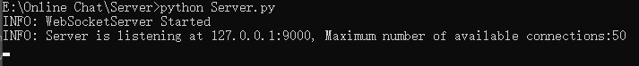
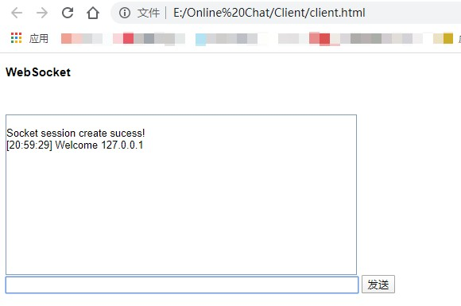

### Online Chat（C to C版）
#### 介绍
在线聊天室（C to C版版）。服务端是采用python socket模块（而非直接使用websockets模块）编写WebSocketServer，客户端采用浏览器的WebSocket对象。实现功能：
- 使用redis list实现类似于消息队列功能
#### 快速开始
- 找到server/socket_server.py，运行命令`python socket_server.py`

- 找到client/client.html所在文件夹，使用浏览器打开`client.html`

- 在输入框随意输入文本，并敲击回车(或点击‘发送’)，观察服务端的log打印
- 相关博文[https://blog.csdn.net/diuleilaomu/article/details/106161293](https://blog.csdn.net/diuleilaomu/article/details/106161293)
>若是github上看不到README中的插图，请参考这篇博文：[解决Github网页上图片显示失败的问题(转载)](https://blog.csdn.net/diuleilaomu/article/details/106167438)